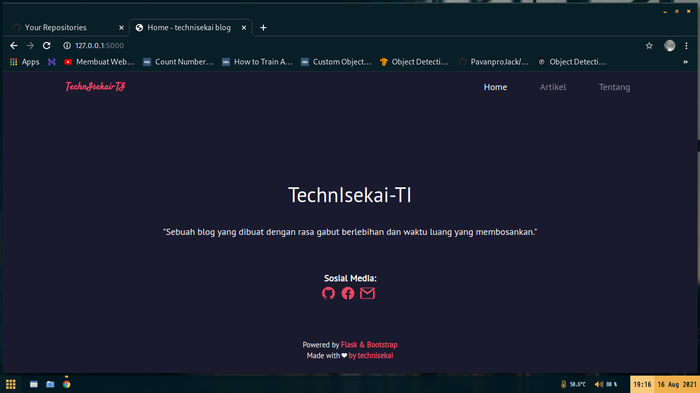

<p align="center">
  
</p>

### :notebook_with_decorative_cover: Description
A blog and covid information made with flask. You can also create an article with markdown in blog version and in covid information it beside show positive, negative, and death in center java because covid, it can make you as contributors to input data covid at your regency in center java. Maybe i will update (or make new repo?)

### :eyes: Overview

- ### **Blog V1**


- ### **Blog V2**


- ### **Covid Information at Center Java**


### :tanabata_tree: How to use
1. Install library
```
pip install Flask==1.1.2
pip install Flask-FlatPages==0.7.2
```
2. Run .py file
